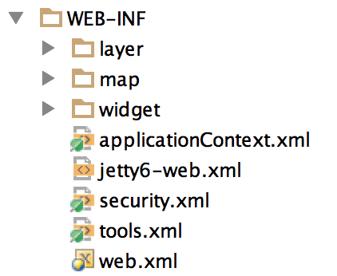
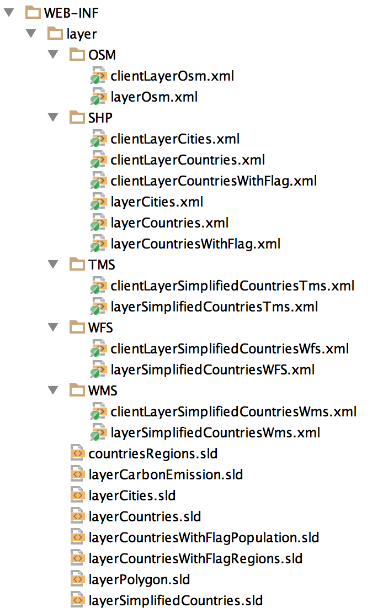

# Geomajas GWT quickstart application

## Introduction</title>
This End-user guide documents the installation, basic configuration and use of the Example Web GIS Application based on 
the Geomajas SmartGWT client.

### What is it?</title>
The Example Application is a stand-alone, ready-to-use Web GIS solution. After installation, 
you can work with the pre-configured sample data layers or you can start adding your own data sources.

The Application has out-of-the-box functionality for navigating the map, searching data, measuring, feature info, etc.
           
###Who can use it?
The Example Application is made as such that it can be used by anybody with average computer skills 
and a basic understanding of GIS. No special system administration and programming skills are required.


##Setting up the Example Application
This chapter describes the different steps you should take to get the application up and running.

###Download the application</title>
Download the Example Application as a stand-alone program. 
This program is self-contained, no additional software is required.

As an alternative you can download the Example Application as .war file. 
Use this alternative when you have an application server available to deploy the .war file.

All downloads are available on the following URL: http://www.geomajas.org/download/

###Run the stand-alone application
The Example Application can be run by executing the appropriate startup script depending on your operating system.

* Use startup.bat for Windows
* Use startup.sh for Linux and Mac

Access the example web GIS application using your web browser on the following URL: http://localhost:8080/geomajas/ 

###Stopping the stand-alone application
The Example Application can be stopped by executing the appropriate shutdown script depending on your operating system.
* Use shutdown.bat for Windows
* Use shutdown.sh for Linux and Mac

##Basic configuration
This section explains how to configure a number of pre-installed functionality, data layers, widgets and 
security in the example application.

###Configuration files structure
The configuration is done in XML files. 
Depending on the installation you chose you can find the configuration files under ROOT/WEB-INF.

* Stand-alone application (.zip) : ROOT = installation-directory/webapps/geomajas/</para>
* Web archive (.war) : ROOT = war file

The WEB-INF folder contains most important configuration files. 
The following scheme shows how the configuration files are structured



1. Folder "layer" - contains layer configuration files including SLDs.
2. Folder "map" - contains mapMain.xml which handles the configuration for the map. 
Here you can define which widgets should be used, which data layers should be included, etc.
3. Folder "widget" - contains widget configuration files for the Legend, the Ribbon Toolbar and the Theme Selector.
4. File "security.xml" - allows you to define the security settings for the application.

###Layer configuration
####General
In the example application the layers are grouped by supported layer type (OSM, SHP, TMS, WFS and WMS). 
The scheme below shows the configured layers per layer type in the "layers" folder. 
Also a set of SLD files for the layers are stored.



For each layer 2 configuration files are required:
* layerNAME.xml : server-side layer configuration defines the layer type, the data source, the geometry type, 
the CRS of the source, the bounding box, the layer attributes and the SLD file.
* clientLayerNAME.xml : client-side layer configuration defines layer name, 
the minimum and maximum zoom level the layer is visible, etc.
               
####Turning pre-configured layers on/off</title>
The layers that are pre-configured in the example application can be switched on and off in the mapMain.xml file 
(property "layers"). Uncomment a line in order to enable the layer in the application. 
Put the line in comments when you want to disable a layer.

In the example below, there are seven layers configured, but only three are enabled in the application. 
The other 4 layers are commented out.

```xml
<property name="layers">
    <list>
        <ref bean="clientLayerOsm" />
        <!-- <ref bean="clientLayerSimplifiedCountriesTms" /> -->
        <!-- <ref bean="clientLayerSimplifiedCountriesWms" /> -->
        <!--<ref bean="clientLayerSimplifiedCountriesWfs" /> -->
        <!--<ref bean="clientLayerCountries" /> -->
        <ref bean="clientLayerCountriesWithFlag" />
        <ref bean="clientLayerCities" />
    </list>
</property>
```

The order in which the layers are drawn on the map is defined by the reverse order in the mapMain.xml. 
In the example above, the OSM layer would be drawn first. 
The layer CountriesWithFlag would be drawn on top of the first one, etc.

> Once you have enabled/disabled a layer, make sure to also include/exclude it from the layer tree!
> How this is done is explained in [the widget section](#widgetSection)
            
####Changing the layer style
The layer style for vector layers (SHP, WFS) is defined using Styled Layer Descriptor (SLD) files.
The pre-configured SLD files can be found in the ROOT/WEB-INF/layer folder.

The server-side layer configuration file defines which SLD file is used to define the layer style.
This is done using the NamedStyleInfo and the property "sldLocation".

In the Example below (extract from the server-side configuration file layerCountriesWithFlag.xml) 
one can see that the layerCountriesWithFlagPopulation.sld is used for styling. 
This value could be replaced with for example layerCountriesWithFlagRegions.sld to apply another style.

```xml
<bean class="org.geomajas.configuration.NamedStyleInfo" name="layerCountriesWithFlagStyleInfo">
    <property name="sldLocation" value="WEB-INF/layer/layerCountriesWithFlagPopulation.sld" />
</bean>
```

> More detailed information about layer styling using SLD can be found found in
> [geoserver styling documentation](http://docs.geoserver.org/latest/en/user/styling/index.html "SLD documentation")

####<a name="widgetSection"></a>Widget configuration
The example application has 3 Geomajas widgets configured: the Ribbon Toolbar, the Layer Tree and the Advanced Views.  
In this section we will only cover the basic configuration for the Layer Tree. 
Learn more about widget configuration in the Geomajas plug-in documentation.

The Layer Tree widget configuration is defined in ROOT/WEB-INF/widget/layerTree.xml. 
The configuration below shows how the different layers are ordered in the layer tree. 
The ordering of the layers in the tree is defined by the sequence in the configuration file. 
Layers can be included/excluded from the layer tree by (un)commenting them.

```xml
<property name="treeNodes">
    <list>
        <bean class="org.geomajas.widget.layer.configuration.client.ClientLayerNodeInfo">
            <property name="layerId" value="clientLayerOsm" />
        </bean>
        <!-- <bean class="org.geomajas.widget.layer.configuration.client.ClientLayerNodeInfo">
            <property name="layerId" value="clientLayerSimplifiedCountriesTms" />
        </bean> -->
        <!--<bean class="org.geomajas.widget.layer.configuration.client.ClientLayerNodeInfo">
            <property name="layerId" value="clientLayerSimplifiedCountriesWms" />
        </bean> -->
        <!-- <bean class="org.geomajas.widget.layer.configuration.client.ClientLayerNodeInfo">
            <property name="layerId" value="clientLayerSimplifiedCountriesWfs" />
        </bean> -->
        <!--<bean class="org.geomajas.widget.layer.configuration.client.ClientLayerNodeInfo">
            <property name="layerId" value="clientLayerCountries" />
        </bean> -->
        <bean class="org.geomajas.widget.layer.configuration.client.ClientLayerNodeInfo">
            <property name="layerId" value="clientLayerCountriesWithFlag" />
        </bean>
        <bean class="org.geomajas.widget.layer.configuration.client.ClientLayerNodeInfo">
            <property name="layerId" value="clientLayerCities" />
        </bean>
    </list>
</property>
```

In the example above, there are 3 layers configured in the layer tree: 
OSM, the Cities layer and the CountriesWithFlag layer. 
The others are commented out and hence not included in the layer tree. 
The order in the layer tree can be configured completely independent from the rendering order.
